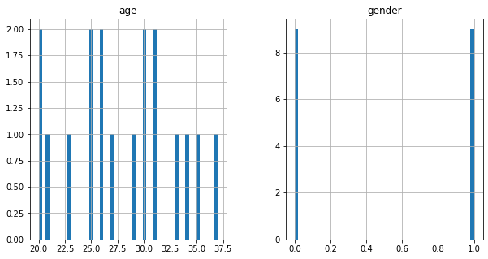
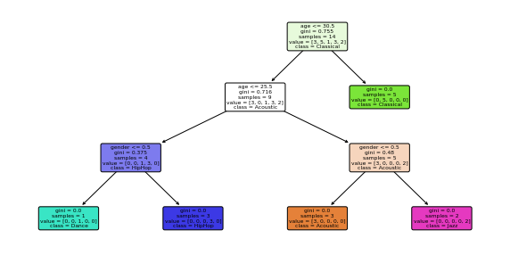

# music-genre-recommendations
Uses a Decision Tree Classifier to make music genre recommendations and visualize the tree created

```python
import pandas as pd
from sklearn.tree import DecisionTreeClassifier
from sklearn.model_selection import train_test_split
from sklearn.metrics import accuracy_score
import joblib
```


```python
music_data = pd.read_csv("music.csv")
music_data
```


<div>
<style scoped>
    .dataframe tbody tr th:only-of-type {
        vertical-align: middle;
    }

    .dataframe tbody tr th {
        vertical-align: top;
    }

    .dataframe thead th {
        text-align: right;
    }
</style>
<table border="1" class="dataframe">
  <thead>
    <tr style="text-align: right;">
      <th></th>
      <th>age</th>
      <th>gender</th>
      <th>genre</th>
    </tr>
  </thead>
  <tbody>
    <tr>
      <th>0</th>
      <td>20</td>
      <td>1</td>
      <td>HipHop</td>
    </tr>
    <tr>
      <th>1</th>
      <td>23</td>
      <td>1</td>
      <td>HipHop</td>
    </tr>
    <tr>
      <th>2</th>
      <td>25</td>
      <td>1</td>
      <td>HipHop</td>
    </tr>
    <tr>
      <th>3</th>
      <td>26</td>
      <td>1</td>
      <td>Jazz</td>
    </tr>
    <tr>
      <th>4</th>
      <td>29</td>
      <td>1</td>
      <td>Jazz</td>
    </tr>
    <tr>
      <th>5</th>
      <td>30</td>
      <td>1</td>
      <td>Jazz</td>
    </tr>
    <tr>
      <th>6</th>
      <td>31</td>
      <td>1</td>
      <td>Classical</td>
    </tr>
    <tr>
      <th>7</th>
      <td>33</td>
      <td>1</td>
      <td>Classical</td>
    </tr>
    <tr>
      <th>8</th>
      <td>37</td>
      <td>1</td>
      <td>Classical</td>
    </tr>
    <tr>
      <th>9</th>
      <td>20</td>
      <td>0</td>
      <td>Dance</td>
    </tr>
    <tr>
      <th>10</th>
      <td>21</td>
      <td>0</td>
      <td>Dance</td>
    </tr>
    <tr>
      <th>11</th>
      <td>25</td>
      <td>0</td>
      <td>Dance</td>
    </tr>
    <tr>
      <th>12</th>
      <td>26</td>
      <td>0</td>
      <td>Acoustic</td>
    </tr>
    <tr>
      <th>13</th>
      <td>27</td>
      <td>0</td>
      <td>Acoustic</td>
    </tr>
    <tr>
      <th>14</th>
      <td>30</td>
      <td>0</td>
      <td>Acoustic</td>
    </tr>
    <tr>
      <th>15</th>
      <td>31</td>
      <td>0</td>
      <td>Classical</td>
    </tr>
    <tr>
      <th>16</th>
      <td>34</td>
      <td>0</td>
      <td>Classical</td>
    </tr>
    <tr>
      <th>17</th>
      <td>35</td>
      <td>0</td>
      <td>Classical</td>
    </tr>
  </tbody>
</table>
</div>


```python
music_data.info()
```

    <class 'pandas.core.frame.DataFrame'>
    RangeIndex: 18 entries, 0 to 17
    Data columns (total 3 columns):
     #   Column  Non-Null Count  Dtype 
    ---  ------  --------------  ----- 
     0   age     18 non-null     int64 
     1   gender  18 non-null     int64 
     2   genre   18 non-null     object
    dtypes: int64(2), object(1)
    memory usage: 560.0+ bytes
    


```python
music_data.hist(bins = 50, figsize=(10,5))
```


    array([[<AxesSubplot:title={'center':'age'}>,
            <AxesSubplot:title={'center':'gender'}>]], dtype=object)


    

    


```python
X = music_data.drop(columns = ["genre"])
X.head()
```


<div>
<style scoped>
    .dataframe tbody tr th:only-of-type {
        vertical-align: middle;
    }

    .dataframe tbody tr th {
        vertical-align: top;
    }

    .dataframe thead th {
        text-align: right;
    }
</style>
<table border="1" class="dataframe">
  <thead>
    <tr style="text-align: right;">
      <th></th>
      <th>age</th>
      <th>gender</th>
    </tr>
  </thead>
  <tbody>
    <tr>
      <th>0</th>
      <td>20</td>
      <td>1</td>
    </tr>
    <tr>
      <th>1</th>
      <td>23</td>
      <td>1</td>
    </tr>
    <tr>
      <th>2</th>
      <td>25</td>
      <td>1</td>
    </tr>
    <tr>
      <th>3</th>
      <td>26</td>
      <td>1</td>
    </tr>
    <tr>
      <th>4</th>
      <td>29</td>
      <td>1</td>
    </tr>
  </tbody>
</table>
</div>


```python
y = music_data["genre"]
y.head()
```


    0    HipHop
    1    HipHop
    2    HipHop
    3      Jazz
    4      Jazz
    Name: genre, dtype: object


```python
X_train, X_test, y_train, y_test = train_test_split(X,y, test_size= 0.2)   # 20% of the dataset will be for testing
```


```python
model = DecisionTreeClassifier()
model.fit(X_train, y_train)
```


<style>#sk-container-id-1 {color: black;background-color: white;}#sk-container-id-1 pre{padding: 0;}#sk-container-id-1 div.sk-toggleable {background-color: white;}#sk-container-id-1 label.sk-toggleable__label {cursor: pointer;display: block;width: 100%;margin-bottom: 0;padding: 0.3em;box-sizing: border-box;text-align: center;}#sk-container-id-1 label.sk-toggleable__label-arrow:before {content: "▸";float: left;margin-right: 0.25em;color: #696969;}#sk-container-id-1 label.sk-toggleable__label-arrow:hover:before {color: black;}#sk-container-id-1 div.sk-estimator:hover label.sk-toggleable__label-arrow:before {color: black;}#sk-container-id-1 div.sk-toggleable__content {max-height: 0;max-width: 0;overflow: hidden;text-align: left;background-color: #f0f8ff;}#sk-container-id-1 div.sk-toggleable__content pre {margin: 0.2em;color: black;border-radius: 0.25em;background-color: #f0f8ff;}#sk-container-id-1 input.sk-toggleable__control:checked~div.sk-toggleable__content {max-height: 200px;max-width: 100%;overflow: auto;}#sk-container-id-1 input.sk-toggleable__control:checked~label.sk-toggleable__label-arrow:before {content: "▾";}#sk-container-id-1 div.sk-estimator input.sk-toggleable__control:checked~label.sk-toggleable__label {background-color: #d4ebff;}#sk-container-id-1 div.sk-label input.sk-toggleable__control:checked~label.sk-toggleable__label {background-color: #d4ebff;}#sk-container-id-1 input.sk-hidden--visually {border: 0;clip: rect(1px 1px 1px 1px);clip: rect(1px, 1px, 1px, 1px);height: 1px;margin: -1px;overflow: hidden;padding: 0;position: absolute;width: 1px;}#sk-container-id-1 div.sk-estimator {font-family: monospace;background-color: #f0f8ff;border: 1px dotted black;border-radius: 0.25em;box-sizing: border-box;margin-bottom: 0.5em;}#sk-container-id-1 div.sk-estimator:hover {background-color: #d4ebff;}#sk-container-id-1 div.sk-parallel-item::after {content: "";width: 100%;border-bottom: 1px solid gray;flex-grow: 1;}#sk-container-id-1 div.sk-label:hover label.sk-toggleable__label {background-color: #d4ebff;}#sk-container-id-1 div.sk-serial::before {content: "";position: absolute;border-left: 1px solid gray;box-sizing: border-box;top: 0;bottom: 0;left: 50%;z-index: 0;}#sk-container-id-1 div.sk-serial {display: flex;flex-direction: column;align-items: center;background-color: white;padding-right: 0.2em;padding-left: 0.2em;position: relative;}#sk-container-id-1 div.sk-item {position: relative;z-index: 1;}#sk-container-id-1 div.sk-parallel {display: flex;align-items: stretch;justify-content: center;background-color: white;position: relative;}#sk-container-id-1 div.sk-item::before, #sk-container-id-1 div.sk-parallel-item::before {content: "";position: absolute;border-left: 1px solid gray;box-sizing: border-box;top: 0;bottom: 0;left: 50%;z-index: -1;}#sk-container-id-1 div.sk-parallel-item {display: flex;flex-direction: column;z-index: 1;position: relative;background-color: white;}#sk-container-id-1 div.sk-parallel-item:first-child::after {align-self: flex-end;width: 50%;}#sk-container-id-1 div.sk-parallel-item:last-child::after {align-self: flex-start;width: 50%;}#sk-container-id-1 div.sk-parallel-item:only-child::after {width: 0;}#sk-container-id-1 div.sk-dashed-wrapped {border: 1px dashed gray;margin: 0 0.4em 0.5em 0.4em;box-sizing: border-box;padding-bottom: 0.4em;background-color: white;}#sk-container-id-1 div.sk-label label {font-family: monospace;font-weight: bold;display: inline-block;line-height: 1.2em;}#sk-container-id-1 div.sk-label-container {text-align: center;}#sk-container-id-1 div.sk-container {/* jupyter's `normalize.less` sets `[hidden] { display: none; }` but bootstrap.min.css set `[hidden] { display: none !important; }` so we also need the `!important` here to be able to override the default hidden behavior on the sphinx rendered scikit-learn.org. See: https://github.com/scikit-learn/scikit-learn/issues/21755 */display: inline-block !important;position: relative;}#sk-container-id-1 div.sk-text-repr-fallback {display: none;}</style><div id="sk-container-id-1" class="sk-top-container"><div class="sk-text-repr-fallback"><pre>DecisionTreeClassifier()</pre><b>In a Jupyter environment, please rerun this cell to show the HTML representation or trust the notebook. <br />On GitHub, the HTML representation is unable to render, please try loading this page with nbviewer.org.</b></div><div class="sk-container" hidden><div class="sk-item"><div class="sk-estimator sk-toggleable"><input class="sk-toggleable__control sk-hidden--visually" id="sk-estimator-id-1" type="checkbox" checked><label for="sk-estimator-id-1" class="sk-toggleable__label sk-toggleable__label-arrow">DecisionTreeClassifier</label><div class="sk-toggleable__content"><pre>DecisionTreeClassifier()</pre></div></div></div></div></div>


```python
predictions = model.predict(X_test)
predictions
```


    array(['Dance', 'Classical', 'Jazz', 'Dance'], dtype=object)


```python
score = accuracy_score(y_test, predictions)
score #Varies from 25% to 100% depends on how much data is used to train model
```


    1.0


```python
joblib.dump(model, "music-recommender.joblib")
```


    ['music-recommender.joblib']


```python
loaded_model = joblib.load("music-recommender.joblib")
loaded_model.predict(X_test)
```


    array(['Dance', 'Classical', 'Jazz', 'Dance'], dtype=object)


```python
from sklearn import tree
import matplotlib.pyplot as plt
```

Visualize the decision tree created by the model


```python
tree.export_graphviz(model, out_file="music-recommender-dot",
                    feature_names= ['age','gender'],
                    class_names=sorted(y.unique()),
                    label = "all",
                    rounded =True,
                    filled=True)
```


```python
plt.figure(figsize =(10,5))
_ = tree.plot_tree(model, feature_names= ['age','gender'],
                  filled = True,
                   class_names=sorted(y.unique()),
                  fontsize=6,
                  rounded=True)
plt.show()
```


    

    

